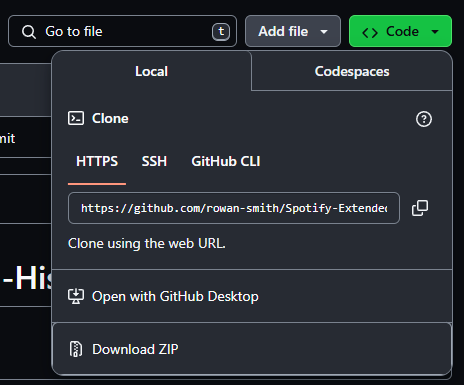
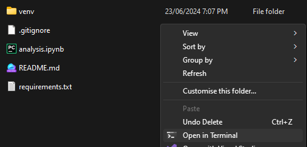
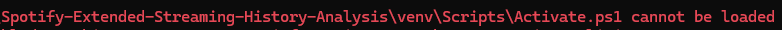
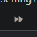

# Spotify Extended Streaming History Analysis

## Prerequisites

---

#### Required
* [Python](https://www.microsoft.com/store/productId/9NCVDN91XZQP?ocid=pdpshare) (version 3 or greater)
* Your Spotify Extended Streaming data to the `/MyData/` subdirectory
  * You can request your data from the [Spotify Account Privacy](https://www.spotify.com/account/privacy/) page.

#### Optional (Not Needed)
* [Git](https://git-scm.com/)

## Setup

---

1. Download or clone this repository to your local machine.
   * Download: 
   * Clone: ``` git clone https://github.com/rowan-smith/Spotify-Extended-Streaming-History-Analysis.git```
2. Open Terminal in download location, the easier way is to right-click in the folder and click `Open in Terminal`
   * 
3. Create virtual environment.
   * ```python -m venv venv```
4. Use virtual environment.
   * ```.\venv\Scripts\activate```
   * If you run into this message: 
     * Set the execution policy ([what this does](https://learn.microsoft.com/en-us/powershell/module/microsoft.powershell.security/set-executionpolicy?view=powershell-7.4#-executionpolicy)):
       * ```Set-ExecutionPolicy RemoteSigned -Scope CurrentUser```
5. Install `requirements.txt` dependencies.
   * ```python -m pip install -r requirements.txt```
6. Populate `\MyData\` with your Spotify Extended Streaming history files (`Streaming_History_Audio_...json`)
7. Open and run Jupyter Notebook.
   * ```jupyter notebook```
8. Navigate to `analysis.ipynb` (Notebook)
9. Click `Restart the kernel and run all cells`
   * 
10. You can now explore your spotify data.

## Web app (GitHub Pages)

A React version of this analysis runs entirely in the browser — no Python required for end users.

**Live site:** after enabling Pages, visit
`https://<your-github-username>.github.io/Spotify-Extended-Streaming-History-Analysis/`

### Enable GitHub Pages

1. Push this repository to GitHub.
2. Go to **Settings → Pages**.
3. Under **Build and deployment**, set **Source** to **Deploy from a branch**.
4. Choose branch **`main`** and folder **`/docs`**.
5. Save. GitHub will serve the static site from the built files in `/docs`.

### Build the web app locally

The source lives in `/web`. Production builds are written to `/docs` for GitHub Pages.

```bash
cd web
npm install
npm run build
```

Commit the updated `/docs` folder, push to `main`, and Pages will pick up the changes.

### Local development

```bash
cd web
npm install
npm run dev
```

Use **Get started** on the page to review the privacy disclaimer, accept it, and load your `Streaming_History_Audio_*.json` exports. Files are processed locally and never uploaded. See the **Assumptions** page for how stats are calculated.

The dashboard mirrors the Jupyter notebook analysis and adds interactive filters:

* Year range, search, top-N, and hide-skipped controls
* Overview, songs, artists, timeline, patterns, and explore tabs
* Sortable/searchable tables for all songs, all artists, and longest listens
* Year drill-down charts with plays vs playtime toggle

## Assumptions

This analysis is built on a few explicit assumptions about Spotify Extended Streaming History data. Understanding them helps interpret the charts and stats.

* **One row = one streaming event.** Each JSON record is counted as a single play/listen, regardless of how long you actually listened.
* **Music only.** Rows without a track name, plus podcast episodes and audiobooks, are excluded so rankings reflect songs.
* **No minimum play duration.** Very short plays and skips are included in listen counts unless a chart specifically filters on `skipped` or `reason_end`.
* **Timestamps are UTC.** Spotify exports `ts` in UTC. Hour-of-day and calendar charts use that timestamp as-is (not your local timezone).
* **Duplicate exports are deduplicated.** If multiple JSON files overlap, rows with the same `ts`, `track_name`, `artist_name`, and `ms_played` are kept once.
* **"Listen count" = row count.** Grouped `count` operations count streaming events, not unique songs or album plays.
* **"Playtime" = sum of `ms_played`.** Total listening time is the sum of milliseconds reported by Spotify for each event.
* **Track identity = `(track_name, artist_name)`.** Same song title by different artists, or metadata changes over time, appear as separate entries.
* **"Most listened" for a period** is the track with the highest metric for that chart (play count or total playtime). Ties are broken by sort order.
* **Completed listen** means `reason_end == 'trackdone'`. That indicates the track finished playing, not necessarily that you listened intentionally start to finish.
* **Skipped track** means `skipped == True` in the export.
* **Listening session** = consecutive plays with no gap longer than 30 minutes between them (`SESSION_GAP` in the notebook).
* **Month/day seasonality charts** pool all Januaries, all 1sts of the month, etc. across every year in your history. They show seasonal patterns, not a running cumulative total over time.

## This analysis explores the following

---

* Earliest Listened Song
* Latest Listened Song
* Your Top 10 Songs (all-time)
* Your Top 10 Artists (all-time)
* Your Top 10 Songs by Year
* Your Top 10 Artists by Year
* Timeline of Song Listens
* What Years do you Listen to the Most Songs?
* Years Listen to the Most Songs
* Months Listen to the Most Songs
* Days Listen to Songs

Todo (Maybe):
* Most Listens of a Song in a Year
* Most Listens of a Song in a Month
* Most Listens of a Song in a Day
* Most Listens of  Song Ever
* Total Unique Songs
* Total Unique Artists
* Genres??? 
* Weekday