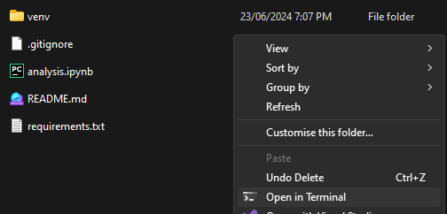

# Spotify Extended Streaming History Analysis

## Prerequisites

---

#### Required
* [Python](https://www.microsoft.com/store/productId/9NCVDN91XZQP?ocid=pdpshare) (version 3 or greater)
* Your Spotify Extended Streaming data to the `/MyData/` subdirectory
  * You can request your data from the [Spotify Account Privacy](https://www.spotify.com/account/privacy/) page.

#### Optional (Not Needed)
* [Git](https://git-scm.com/)

## Setup

---

1. Download or clone this repository to your local machine.
   * Download: 
   * Clone: ``` git clone https://github.com/rowan-smith/Spotify-Extended-Streaming-History-Analysis.git```
2. Open Terminal in download location, the easier way is to right-click in the folder and click `Open in Terminal`
   * 
3. Create virtual environment.
   * ```python -m venv venv```
4. Use virtual environment.
   * ```.\venv\Scripts\activate```
   * If you run into this message: 
     * Set the execution policy ([what this does](https://learn.microsoft.com/en-us/powershell/module/microsoft.powershell.security/set-executionpolicy?view=powershell-7.4#-executionpolicy)):
       * ```Set-ExecutionPolicy RemoteSigned -Scope CurrentUser```
5. Install `requirements.txt` dependencies.
   * ```python -m pip install -r requirements.txt```
6. Populate `\MyData\` with your Spotify Extended Streaming history files (`Streaming_History_Audio_...json`)
7. Open and run Jupyter Notebook.
   * ```jupyter notebook```
8. Navigate to `analysis.ipynb` (Notebook)
9. Click `Restart the kernel and run all cells`
   * 
10. You can now explore your spotify data.

## This analysis explores the following

---

* Earliest Listened Song
* Latest Listened Song
* Your Top 20 Songs (all-time)
* Your Top 20 Artists of (all-time)
* Your Top 10 Songs by Year
* Your Top 10 Artists by Year
* Timeline of Song Listens
* What Years do you Listen to the Most Songs?
* Years Listen to the Most Songs
* Months Listen to the Most Songs
* Days Listen to Songs

Todo (Maybe):
* Most Listens of a Song in a Year
* Most Listens of a Song in a Month
* Most Listens of a Song in a Day
* Most Listens of  Song Ever
* Total Unique Songs
* Total Unique Artists
* Genres??? 
* Weekday